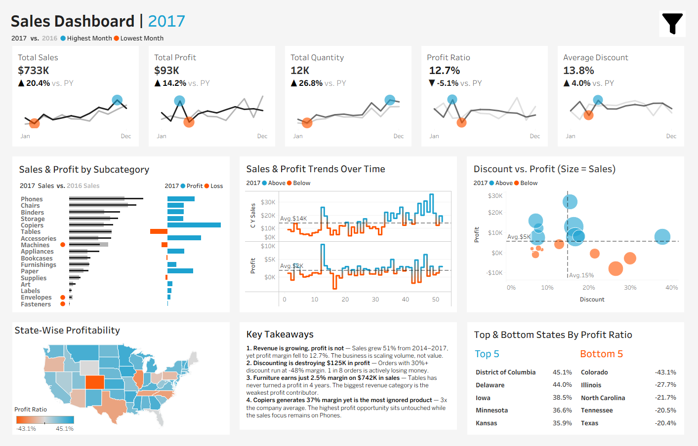

# 🛒 Superstore Sales Dashboard — Tableau

> Finding where a $2.3M business was quietly bleeding profit.

---

## 📌 Project Overview

Built an interactive Tableau dashboard on the Sample Superstore dataset to analyse 4 years of retail sales data (2014–2017) across 9,994 orders.

This wasn't just a "make it look pretty" project.
The goal was to find real business problems hiding inside good-looking revenue numbers.

---

## 🔍 What I Found

**1. Revenue grew 51% — profit margin fell**
Sales went from $484K in 2014 to $733K in 2017.
But profit margin dropped in 2017 despite record sales.
The business was buying growth through discounts, not earning it.

**2. Discounting destroyed $125,000 in profit**
Orders with 30%+ discount ran at -48% margin.
Nearly 1 in 5 orders was actively losing money.
Rising average discount + falling margin = a policy that's silently killing the business.

**3. Furniture — $742K revenue, 2.5% margin**
Looks like a strong category on the surface.
Tables sub-category has been loss-making for all 4 years.
Total Tables loss = -$17,725 on $207K of sales.

**4. Copiers = 37% margin. Completely ignored.**
3x the company average margin.
Gets a fraction of the sales focus compared to Phones.
Single biggest missed profit opportunity in the portfolio.

---

## 📊 Dashboard Features

- KPI cards — Sales, Profit, Quantity, Margin, Avg Discount with YoY comparison
- Sales & Profit by Sub-category
- Monthly trend line — Sales & Profit over time
- Discount vs Profit scatter (bubble size = Sales)
- State-wise profitability map
- Top & Bottom 5 states by profit ratio
- Filters — Year, Category, Sub-category, Region, State, City

---

## 🛠️ Tools Used

- Tableau Public
- Sample Superstore Dataset (built-in Tableau dataset)
- Excel (initial data exploration)

---

## 📁 Files

| File | Description |
|------|-------------|
| `Superstore_Dashboard.twbx` | Tableau packaged workbook |
| `Sample_Superstore.csv` | Raw dataset |
| `Dashboard_Screenshot.png` | Dashboard preview |

---

## 💡 Key Calculations Used

| Metric | Formula |
|--------|---------|
| Profit Margin % | `SUM(Profit) / SUM(Sales) × 100` |
| Discount Damage | `SUM(Sales × Discount)` |
| YoY Growth | `(Current Year - Prior Year) / Prior Year × 100` |

---

## 🎯 Business Recommendations

1. **Cap discounts at 20%** across all categories — especially Furniture
2. **Reprice or discontinue Tables** — 4 years of losses is a structural problem
3. **Shift sales focus to Copiers** — highest margin, lowest attention
4. **Treat Central region as priority fix** — 7.9% margin vs 14.9% in West

---

## 👤 About Me

Fresher | Aspiring Data Analyst | Learning Tableau, Excel & SQL

📧 nirmalyabag2003@gmail.com
🔗 https://www.linkedin.com/in/nirmalya-bag-1026012b6/

---

⭐ If you found this useful, drop a star — it keeps me motivated!
